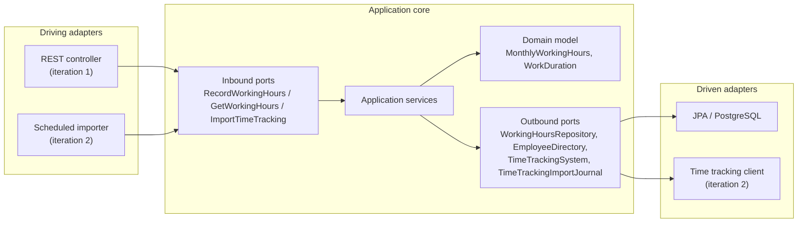

# Architecture

The application follows a **hexagonal architecture** (ports and adapters). The
decision and its trade-offs are recorded in
[ADR 0005](./adr/0005-hexagonal-architecture.md).

## Why it fits this assignment

Two independent ways to write the same data — a REST endpoint and a scheduled
import — plus one external system to read from. A layered design would share
the business rule between both paths just as well. What the ports add:

- **Every write enters through an inbound port.** Neither adapter can reach the
  store on its own and skip the precedence and conflict rules — `ArchitectureTest`
  fails the build if one tries.
- **The business rules can be exercised without Spring or a database.** No
  framework types in `domain` and `application`, and ports narrow enough to
  implement in memory, so a use case can be instantiated with `new` in tests.
- **The domain model is not shaped by the ORM.** The aggregate stays final and
  factory-built, and the locking version stays an infrastructure concern.
- **The external system exists only as a substitute.** It is fictitious and has
  to be simulated either way; the port decides whether that stand-in is one
  adapter among others or the production code path itself.

Replaceability is claimed for that system only — PostgreSQL is a fixed choice
([ADR 0001](./adr/0001-postgresql-with-flyway.md)).



## Package structure

One Gradle module. The hexagon boundary is expressed by packages and enforced by
an ArchUnit test, not by build modules — that keeps the demo readable while the
dependency rule stays verifiable.

```
dev.svitzthum.payroll
├── PayrollApplication
├── workinghours                        ← feature slice
│   ├── domain                          ← no framework dependencies at all
│   │   ├── MonthlyWorkingHours         ← aggregate, holds the invariants
│   │   ├── WorkDuration                ← value object, whole minutes, built from java.time.Duration
│   │   └── WorkingHoursSource          ← MANUAL | TIME_TRACKING
│   ├── application
│   │   ├── port/in                     ← use case interfaces + commands
│   │   ├── port/out                    ← repository / directory interfaces
│   │   └── service                     ← use case implementations, @Transactional
│   └── adapter
│       ├── in/web                      ← controller, DTOs, exception handling
│       ├── in/scheduler                ← scheduled import job (iteration 2)
│       ├── out/persistence             ← JPA entities, Spring Data, mapper
│       └── out/timetracking            ← simulated external system (iteration 2)
└── shared                              ← cross-cutting configuration
```

## Dependency rule

- `domain` depends on nothing but the JDK. No Spring, no JPA, no Jackson.
- `application` depends on `domain` and on its own ports only.
- `adapter` depends on `application` and `domain`; adapters never depend on
  each other, and a driving adapter sees inbound ports only — never the
  repository port or a service implementation.
- Nothing outside `adapter.out.persistence` sees a JPA entity, nothing outside
  `adapter.in.web` sees a DTO.

`ArchitectureTest` asserts these rules as part of the normal test run.

## Costs accepted

- **Two models for the monthly value**: a domain aggregate and a JPA entity,
  with an explicit mapper. This costs a mapper class but keeps the persistence
  schema from dictating the domain model — and it makes the optimistic locking
  version an infrastructure concern rather than a business attribute.
- **Interfaces only where a boundary exists**: ports are interfaces because they
  are crossed by different adapters. Internal helper classes are not abstracted
  behind interfaces just for symmetry.
- **Transactions live in the application services**, i.e. at the inbound port
  boundary, so both the REST adapter and the scheduler get identical semantics.

