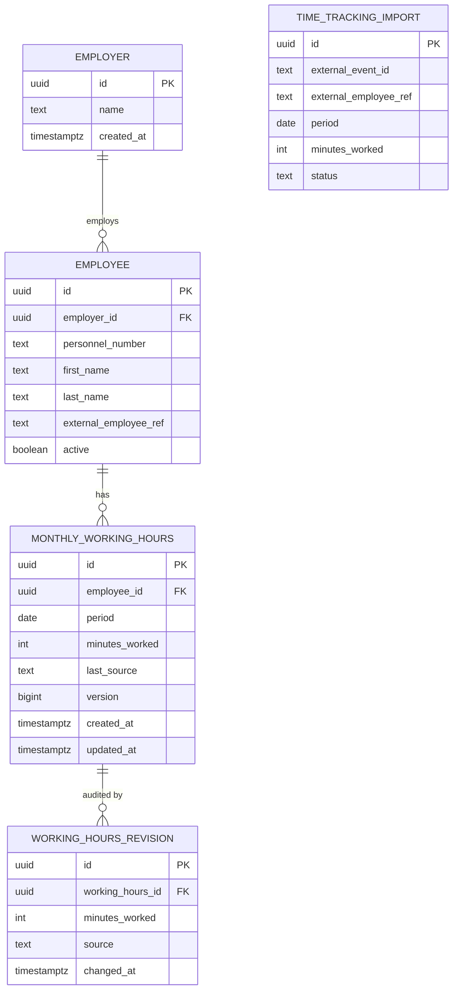

# Data Model

## Scope of this document

This document describes the **relational schema owned by the persistence
adapter** (`adapter.out.persistence`), not the domain model. Following
[ADR 0005](./adr/0005-hexagonal-architecture.md), the domain works with its own
types (`MonthlyWorkingHours`, `WorkDuration`) and never sees a JPA entity; a
mapper translates between the two. Technical columns such as `id` therefore
exist in the schema but not in the domain model.

## Overview

The core aggregate is `monthly_working_hours`: exactly one row per employee and
calendar month. `employer` and `employee` are master data. The remaining tables
belong to iteration 2 and are listed here to show that the schema of iteration 1
does not have to be broken later.

## Tables

### `employer` (iteration 1)

Tenant of the payroll software, i.e. the company whose managing director uses
the application.

| Column | Type | Notes |
| --- | --- | --- |
| `id` | `uuid` | primary key |
| `name` | `text` | not null |
| `created_at` | `timestamptz` | not null |

No security layer is built on top of it yet, but the tenant boundary exists in
the model from the start.

### `employee` (iteration 1)

| Column | Type | Notes |
| --- | --- | --- |
| `id` | `uuid` | primary key |
| `employer_id` | `uuid` | FK to `employer` |
| `personnel_number` | `text` | unique per employer |
| `first_name`, `last_name` | `text` | not null |
| `external_employee_ref` | `text` | nullable, identifier in the time tracking system, unique per employer |
| `active` | `boolean` | not null, default `true` |

Constraints: `unique (employer_id, personnel_number)`,
`unique (employer_id, external_employee_ref)`.

### `monthly_working_hours` (iteration 1)

| Column | Type | Notes |
| --- | --- | --- |
| `id` | `uuid` | primary key |
| `employee_id` | `uuid` | FK to `employee` |
| `period` | `date` | first day of the month |
| `minutes_worked` | `integer` | not null |
| `last_source` | `text` | `MANUAL` or `TIME_TRACKING` |
| `version` | `bigint` | optimistic locking |
| `created_at`, `updated_at` | `timestamptz` | not null |

Constraints:

- `unique (employee_id, period)` — the central invariant: one value per employee
  and month, enforced by the database and therefore independent of the writing
  code path.
- `check (period = date_trunc('month', period))` — periods are normalised.
- `check (minutes_worked between 0 and 44640)` — plausibility bound (31 days).

### `working_hours_revision` (iteration 2)

Append-only change history: which source changed the value when and to what.
Makes corrections traceable and gives the concurrency story a visible audit
trail.

### `time_tracking_import` (iteration 2)

Journal of received import events with a unique `external_event_id`, providing
idempotency for the scheduled import even if the external system delivers an
event twice.

## Design decisions

- **`period` as `date` on the first of the month** instead of separate year and
  month columns: index friendly, supports range queries and maps cleanly to
  `java.time.YearMonth` via an `AttributeConverter`.
- **Minutes as `integer`** instead of decimal hours: no rounding issues, exact
  aggregation. The API exchanges ISO 8601 durations (`PT152H30M`), which convert
  to and from whole minutes without any arithmetic loss. See
  [ADR 0003](./adr/0003-store-durations-as-minutes.md).
- **Single row per employee and month** with the source as an attribute, instead
  of one row per source: keeps the payroll relevant value unambiguous and makes
  the unique constraint the actual guard. See
  [ADR 0004](./adr/0004-unique-constraint-and-optimistic-locking.md).
- **Relations by ID** rather than bidirectional JPA associations: keeps aggregate
  boundaries explicit and avoids accidental lazy loading cascades.
- **Schema owned by Flyway**, Hibernate only validates. See
  [ADR 0001](./adr/0001-postgresql-with-flyway.md).
- **Optimistic locking version is infrastructure**: the `version` column lives on
  the JPA entity. The domain aggregate carries the value it was loaded with as a
  plain `long` so the repository port can detect concurrent modification, but it
  never interprets it.

